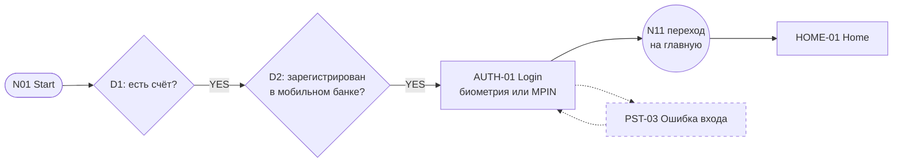
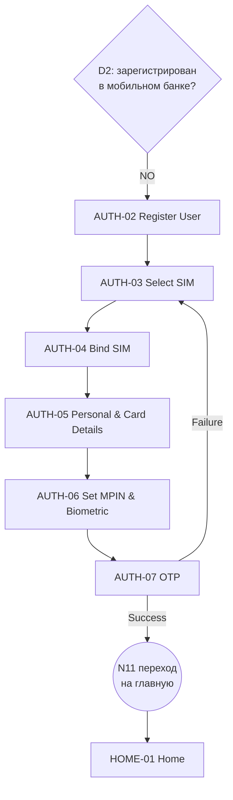
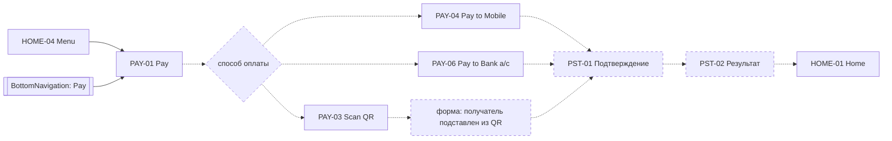
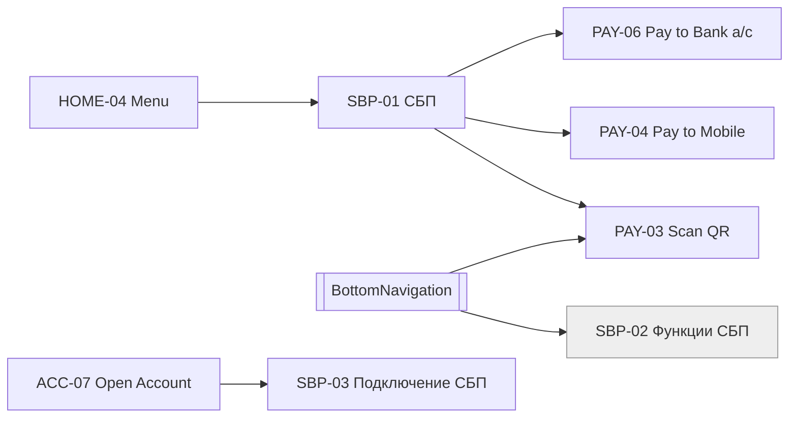
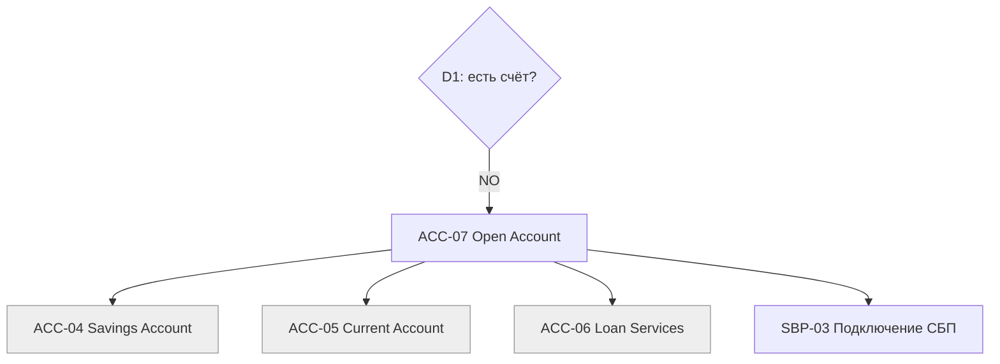
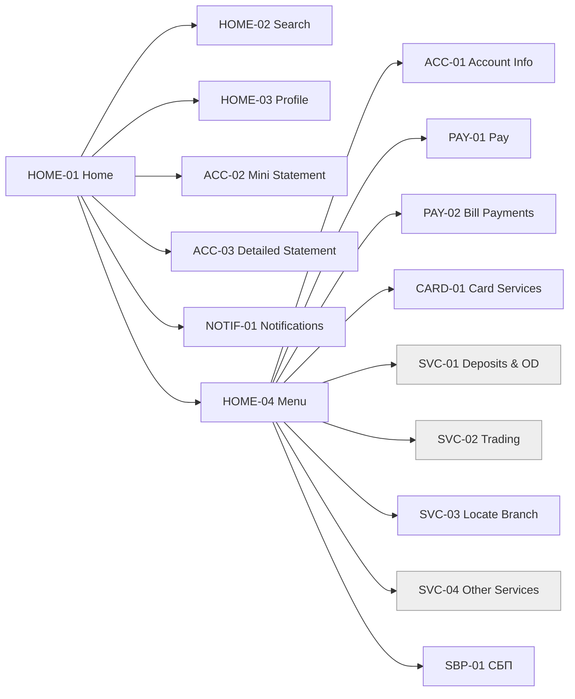

# Пользовательские флоу (Уровень 2 — User Flows)

Часть UI-спецификации Banking Shell. ID экранов — из [SCREEN_INVENTORY.md](SCREEN_INVENTORY.md). Источник — [`refs/R38-user-flow.jpg`](../../refs/R38-user-flow.jpg).
Принятые решения `[D-xx]` — в [журнале решений](UI_ARCHITECTURE.md#журнал-решений). По [D-01] UPI со схемы заменён на СБП.

**Как читать схемы:**

| Обозначение | Значение |
|---|---|
| Сплошная стрелка | Переход есть на схеме-источнике `[S]` или следует из принятого решения `[D-xx]` |
| Пунктирная стрелка | Переход предложен `[A]` или взят из ROADMAP `[R]` |
| Ромб | Решение |
| Пунктирная рамка | Предложенное состояние флоу (`PST-xx`). В инвентарь экранов не входит |
| Серая рамка | Кандидат (`CANDIDATE`) |

---

## Предложенные состояния флоу

На схеме этих состояний нет, но без них флоу не замыкается. Это **предложения**: пока они не подтверждены, экранами не считаются.

| ID | Состояние | Зачем нужно | Может оказаться |
|---|---|---|---|
| PST-01 | Подтверждение платежа | В PAY-04 и PAY-06 нет шага проверки перед отправкой | Шторка поверх формы платежа или отдельный экран |
| PST-02 | Результат платежа | На схеме не показано, чем заканчивается платёж | Отдельный экран |
| PST-03 | Ошибка входа | У AUTH-01 на схеме нет ветки ошибки | Состояние экрана AUTH-01, не отдельный экран |

---

## A. Вход существующего пользователя

- **Из схемы:** Start → D1 = YES → D2 = YES → AUTH-01 → переход N11 → HOME-01.
- **Не описано:** как приложение принимает решения D1 и D2. Экрана-вопроса («Вы уже клиент?») на схеме нет, см. [Q-02](SCREEN_INVENTORY.md#q-02).
- **Из схемы:** без биометрии вход идёт по MPIN — узел N04 «biometric or MPIN» ([Q-08](SCREEN_INVENTORY.md#q-08), закрыт).
- **Не описано:** что происходит при неверном MPIN. Предложено состояние PST-03.

## B. Регистрация нового пользователя в мобильном банке

- **Из схемы:** весь путь целиком, включая Success → главная и Failure → AUTH-03 Select SIM.
- **Порядок шагов — по схеме:** OTP стоит после установки MPIN, при ошибке пользователь возвращается к выбору SIM. Онбординг идёт по R38 [D-02], поэтому порядок не меняем ([Q-07](SCREEN_INVENTORY.md#q-07), эта часть закрыта).
- **Решено [D-02]:** главный онбординг — этот, из R38. Какие поля регистрации по Revolut (R01) из ROADMAP войдут в AUTH-02 и AUTH-05 — [Q-22](UI_ARCHITECTURE.md#открытые-вопросы).
- **Решено [D-03]:** выбор и привязка SIM в браузере имитируются.
- **UNKNOWN:** что происходит при ошибке привязки SIM (AUTH-04). На схеме этого нет, на данные не влияет ([Q-07](SCREEN_INVENTORY.md#q-07)).

## C. Платёж

По [D-04] Pay — одна точка входа в платежи с двумя входами: из нижней навигации и из меню. На схеме у PAY-01 Pay **нет исходящих связей**. Поэтому флоу ниже собран так: способы оплаты взяты из раздела СБП (флоу D), а подтверждение и результат — предложенные состояния.

| Шаг | Где происходит | Источник |
|---|---|---|
| Меню или нижняя навигация → Pay | HOME-04 → PAY-01; BottomNavigation → PAY-01 | [S], [D-04] |
| Выбор способа оплаты | PAY-01 | [A]: у Pay на схеме нет связей. Список способов взят из раздела СБП |
| Получатель и сумма | PAY-04, PAY-06 — одна форма `PaymentForm` | Экраны [S], состав формы [A] |
| Банк получателя | PAY-04, после ввода телефона | [D-06] |
| Подтверждение | PST-01 | [A] |
| Результат | PST-02 | [A] |
| Возврат на главную | PST-02 → HOME-01 | [A] |

Узел Pay to UPI ID со схемы убран: в СБП у него нет аналога [D-06].

**Оплата услуг (PAY-02)** на схеме тоже заканчивается тупиком. Предложено вести её через ту же форму и PST-01 → PST-02 [A]. Содержимое раздела — [Q-11](SCREEN_INVENTORY.md#q-11).

## D. СБП

На схеме это ветка UPI. По [D-01] — СБП, по [D-04] — раздел внутри домена платежей, а не отдельный бизнес-домен.

- **Из схемы:**
  - СБП (на схеме UPI) → способы перевода; из четырёх остались три — Pay to UPI ID убран [D-06];
  - Scan QR доступен и из СБП, и из нижней навигации;
  - подключение СБП (на схеме Register UPI) находится в ветке открытия счёта.
- **Решено [D-04]:** SBP-02 Функции СБП стоит рядом с Settings и с SBP-01 **не объединяется**. Это кандидат и, скорее всего, группа пунктов навигации.
- **Решено [D-06]:**
  - перевод по UPI ID убран;
  - перевод по реквизитам (PAY-06) остаётся в разделе СБП;
  - SBP-03 — сделать этот банк банком по умолчанию для входящих переводов СБП;
  - при переводе по телефону (PAY-04) пользователь выбирает банк получателя.

## E. Настройки

- **Из схемы:** в настройки попадают из нижней навигации. Там смена MPIN, биометрия, язык и выход.
- **Logout** — действие, а не экран. После выхода сессии нет, поэтому пользователь возвращается во вход до авторизации (N01 → D1/D2). Какой экран он увидит первым, зависит от [Q-02](SCREEN_INVENTORY.md#q-02); на схеме пунктиром показан AUTH-01 как вариант [A]. Подтверждение выхода — [Q-16](SCREEN_INVENTORY.md#q-16).

## F. Открытие счёта

- **Из схемы:** все пять узлов и связи между ними.
- **Тупик:** из ветки нет пути ни в регистрацию, ни на главную — [Q-02](SCREEN_INVENTORY.md#q-02).
- **Состояние сессии не определено:** ACC-07 доступен до входа (D1 = NO), а SBP-03 по [D-06] настраивает банк по умолчанию, для чего нужен известный клиент — [Q-02](SCREEN_INVENTORY.md#q-02).

## G. Главная и меню

По [D-04] схема читается так: верхние ветки — главная, а ветки от Account Information и ниже — содержимое меню.

- **Главная [D-04]:** поиск, профиль, мини-выписка, подробная выписка, уведомления, меню и нижняя навигация.
- **Меню [D-04]:** 9 уникальных направлений. Card Services на схеме нарисован дважды, это один экран.
- **Notifications** оставлены на главной: в меню по [D-04] входят ветки начиная с Account Information, а уведомления на схеме выше.
- **Зарезервировано [D-05]:** кредитная карта, кешбэк и накопления. Проектируются отдельно; место в навигации определится тогда же.
- **Не описано:** на главной мини-выписка — это блок или ссылка на экран, см. [Q-10](SCREEN_INVENTORY.md#q-10).

## H. Нижняя навигация

`BottomNavigation` — глобальный компонент (узел N19), а не экран.

| Пункт | Куда ведёт | Источник |
|---|---|---|
| Go to Home | HOME-01 | [S] |
| Pay | PAY-01 | [S] |
| Scan QR | PAY-03 | [S] |
| Settings | SET-01 | [S] |
| UPI Functions → Функции СБП | SBP-02 (кандидат, группа навигации) | [S], [D-01], [D-04] |

- **Не описано:** на каких экранах показывается нижняя навигация. Предложено: в `AppShell(main)`, то есть на экранах после входа [A].
- **Не описано:** связан ли HOME-04 Menu с SET-01. На схеме настройки открываются только из нижней навигации.
- **Pay в нижней навигации и Pay в меню** — один экран PAY-01 [D-04].

---

## Сводка: какие переходы откуда

| Флоу | Переходы из схемы [S] и решений [D] | Предложенные [A] | Тупики и неясности |
|---|---|---|---|
| A. Вход | Start → D1 → D2 → AUTH-01 → HOME-01 | PST-03 ошибка входа | Как принимаются решения D1 и D2 (Q-02) |
| B. Регистрация | AUTH-02 → … → AUTH-07 → HOME-01; Failure → AUTH-03 | — | Ошибка на AUTH-04 (UNKNOWN); поля из R01 (Q-22) |
| C. Платёж | Меню и нижняя навигация → PAY-01 [D-04] | Способ оплаты, PST-01, PST-02 | У PAY-01 нет исходящих связей |
| D. СБП | SBP-01 → PAY-03, PAY-04, PAY-06 | → PST-01 → PST-02 | — |
| E. Настройки | SET-01 → SET-02…04, Logout | Logout → вход до авторизации (первый экран — Q-02) | Подтверждение выхода (Q-16) |
| F. Открытие счёта | D1 → ACC-07 → ACC-04…06, SBP-03 | — | Нет выхода из ветки; состояние сессии (Q-02) |
