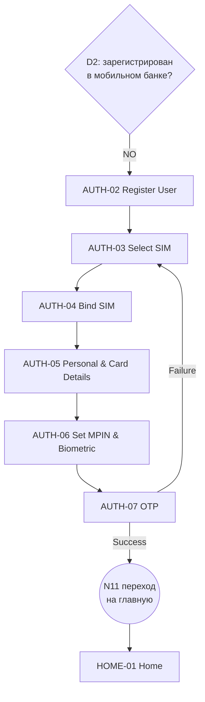
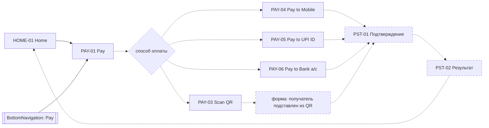
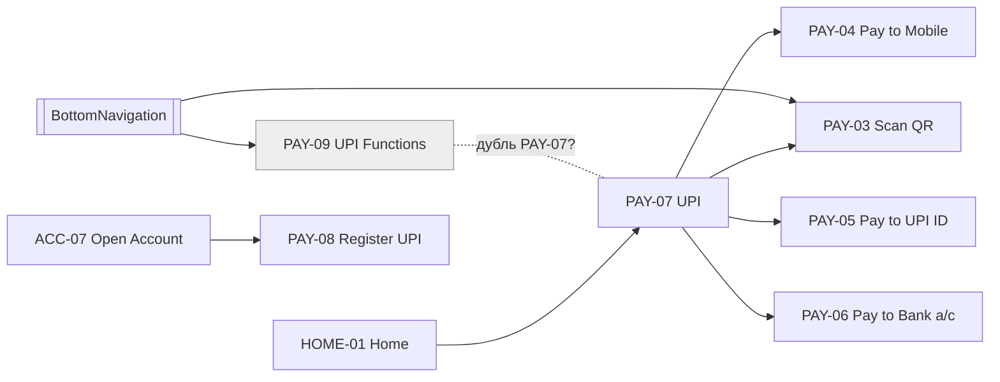
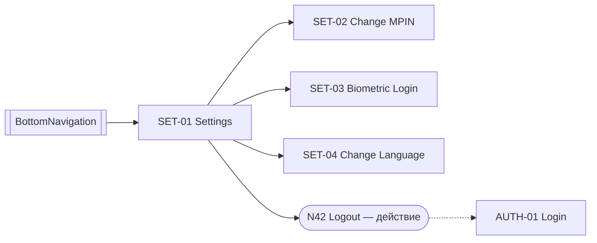
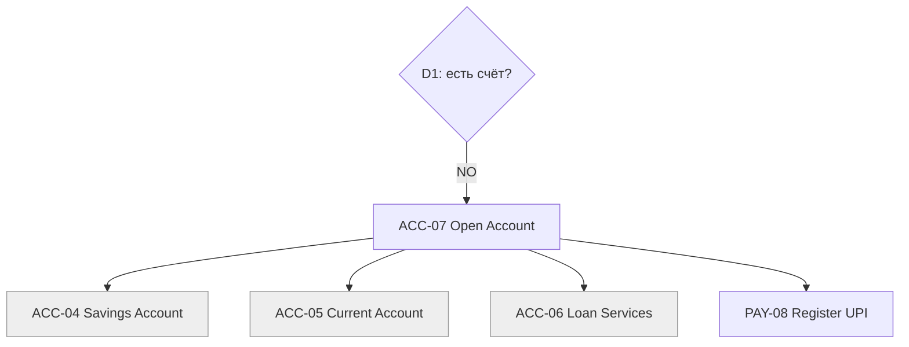
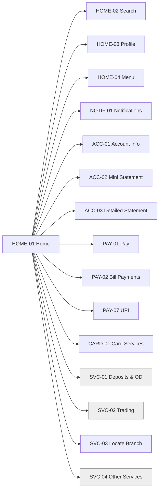

# Пользовательские флоу (Уровень 2 — User Flows)

Часть UI-спецификации Banking Shell. ID экранов — из [SCREEN_INVENTORY.md](SCREEN_INVENTORY.md). Источник — [`refs/R38-user-flow.jpg`](../../refs/R38-user-flow.jpg).

**Как читать схемы:**

| Обозначение | Значение |
|---|---|
| Сплошная стрелка | Переход есть на схеме-источнике `[S]` |
| Пунктирная стрелка | Переход предложен `[A]` или взят из ROADMAP `[R]` |
| Ромб | Решение |
| Пунктирная рамка | Предложенное состояние флоу (`PST-xx`). В инвентарь экранов не входит |
| Серая рамка | Кандидат (`CANDIDATE`) |

---

## Предложенные состояния флоу

На схеме этих состояний нет, но без них флоу не замыкается. Это **предложения**: пока они не подтверждены, экранами не считаются.

| ID | Состояние | Зачем нужно | Может оказаться |
|---|---|---|---|
| PST-01 | Подтверждение платежа | В PAY-04, PAY-05, PAY-06 нет шага проверки перед отправкой | Шторка поверх формы платежа или отдельный экран |
| PST-02 | Результат платежа | На схеме не показано, чем заканчивается платёж | Отдельный экран |
| PST-03 | Ошибка входа | У AUTH-01 на схеме нет ветки ошибки | Состояние экрана AUTH-01, не отдельный экран |

---

## A. Вход существующего пользователя

- **Из схемы:** Start → D1 = YES → D2 = YES → AUTH-01 → переход N11 → HOME-01.
- **Не описано:** как приложение принимает решения D1 и D2. Экрана-вопроса («Вы уже клиент?») на схеме нет, см. [Q-02](SCREEN_INVENTORY.md#q-02).
- **Не описано:** что происходит при неверном MPIN. Предложено состояние PST-03.

## B. Регистрация нового пользователя в мобильном банке

- **Из схемы:** весь путь целиком, включая Success → главная и Failure → AUTH-03 Select SIM.
- **Вопрос:** порядок шагов. OTP стоит после установки MPIN, а при ошибке пользователь возвращается к выбору SIM, см. [Q-07](SCREEN_INVENTORY.md#q-07).
- **Вопрос:** расхождение с ROADMAP. В этапе 1 роадмапа регистрация устроена по Revolut (R01): страна, телефон, адрес, почта, дата рождения, пароль. Какой вариант главный — [Q-04](SCREEN_INVENTORY.md#q-04).
- **Вопрос:** что происходит при ошибке привязки SIM (AUTH-04). На схеме этого нет.

## C. Платёж

На схеме у PAY-01 Pay **нет исходящих связей**. Поэтому флоу ниже собран так: способы оплаты взяты из ветки UPI (флоу D), а подтверждение и результат — предложенные состояния.

| Шаг | Где происходит | Источник |
|---|---|---|
| Home → Pay | HOME-01 → PAY-01 | [S] |
| Выбор способа оплаты | PAY-01 | [A]: у Pay на схеме нет связей. Список способов взят из ветки UPI |
| Получатель и сумма | PAY-04, PAY-05, PAY-06 — одна форма `PaymentForm` | Экраны [S], состав формы [A] |
| Подтверждение | PST-01 | [A] |
| Результат | PST-02 | [A] |
| Возврат на главную | PST-02 → HOME-01 | [A] |

**Оплата услуг (PAY-02)** на схеме тоже заканчивается тупиком. Предложено вести её через ту же форму и PST-01 → PST-02 [A]. Содержимое раздела — [Q-11](SCREEN_INVENTORY.md#q-11).

## D. UPI

- **Из схемы:**
  - UPI → четыре способа оплаты;
  - Scan QR доступен и из UPI, и из нижней навигации;
  - Register UPI находится в ветке открытия счёта.
- **Вопросы:**
  - связь PAY-01, PAY-07 и PAY-09 — [Q-06](SCREEN_INVENTORY.md#q-06);
  - заменять ли UPI на СБП или SPEI — [Q-14](SCREEN_INVENTORY.md#q-14).

## E. Настройки

- **Из схемы:** в настройки попадают из нижней навигации. Там смена MPIN, биометрия, язык и выход.
- **Logout** — действие, а не экран. Куда оно ведёт, на схеме не показано. Предложено: на AUTH-01 [A], см. [Q-16](SCREEN_INVENTORY.md#q-16).

## F. Открытие счёта

- **Из схемы:** все пять узлов и связи между ними.
- **Тупик:** из ветки нет пути ни в регистрацию, ни на главную — [Q-02](SCREEN_INVENTORY.md#q-02).

## G. Главная как хаб

- **Из схемы:** с главной ведут 15 уникальных направлений. Card Services нарисован дважды, это один экран.
- **Не описано:** какие направления показываются на самой главной, а какие уходят в меню — [Q-09](SCREEN_INVENTORY.md#q-09).

## H. Нижняя навигация

`BottomNavigation` — глобальный компонент (узел N19), а не экран.

| Пункт | Куда ведёт | Источник |
|---|---|---|
| Go to Home | HOME-01 | [S] |
| Pay | PAY-01 | [S] |
| Scan QR | PAY-03 | [S] |
| Settings | SET-01 | [S] |
| UPI Functions | PAY-09 (кандидат) | [S] |

- **Не описано:** на каких экранах показывается нижняя навигация. Предложено: на экранах после входа [A].
- **Не описано:** связан ли HOME-04 Menu с SET-01. На схеме настройки открываются только из нижней навигации.

---

## Сводка: какие переходы откуда

| Флоу | Переходы из схемы [S] | Предложенные [A] | Тупики и неясности |
|---|---|---|---|
| A. Вход | Start → D1 → D2 → AUTH-01 → HOME-01 | PST-03 ошибка входа | Как принимаются решения D1 и D2 |
| B. Регистрация | AUTH-02 → … → AUTH-07 → HOME-01; Failure → AUTH-03 | — | Порядок OTP и MPIN; ошибка на AUTH-04 |
| C. Платёж | HOME-01 → PAY-01 | Способ оплаты, PST-01, PST-02 | У PAY-01 нет исходящих связей |
| D. UPI | PAY-07 → PAY-03…06 | PAY-03…06 → PST-01 → PST-02 | PAY-09 — дубль или нет |
| E. Настройки | SET-01 → SET-02…04, Logout | Logout → AUTH-01 | Подтверждение выхода |
| F. Открытие счёта | D1 → ACC-07 → ACC-04…06, PAY-08 | — | Нет выхода из ветки |
