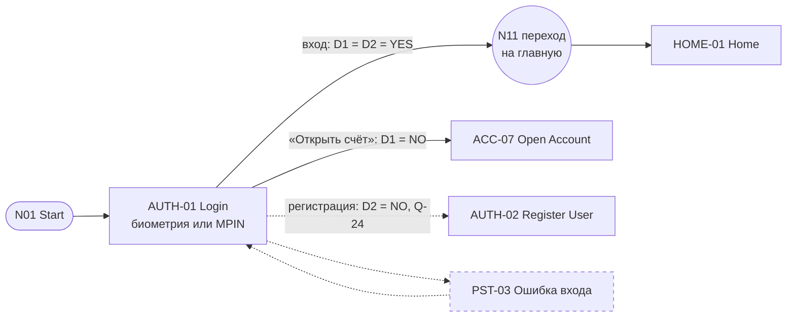
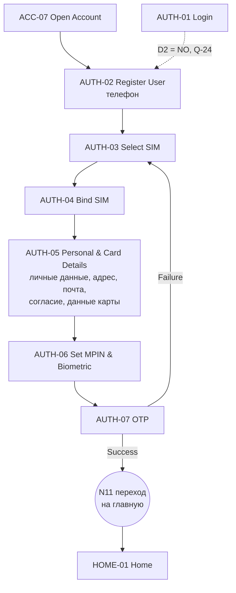
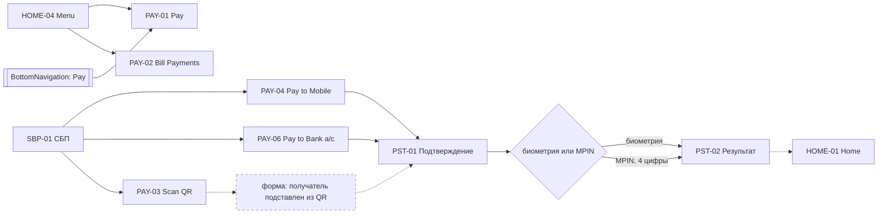
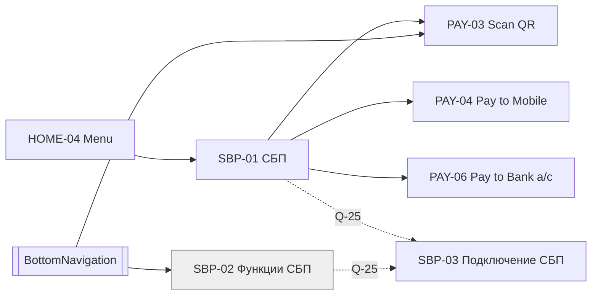
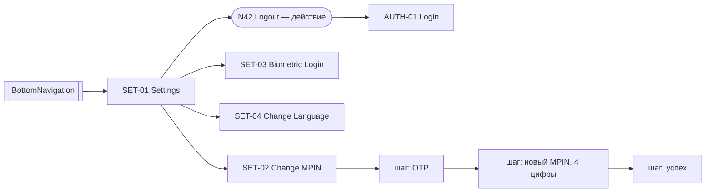
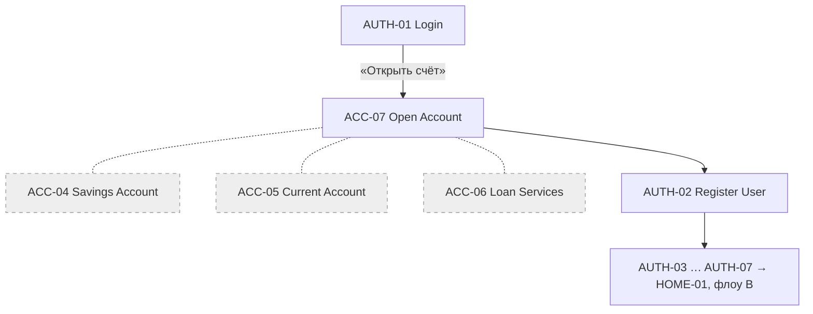
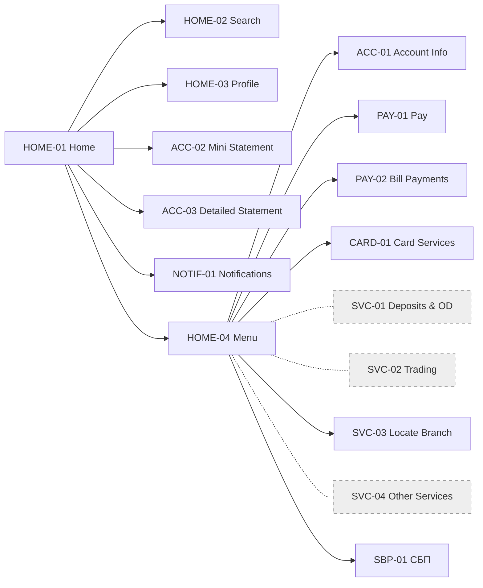

# Пользовательские флоу (Уровень 2 — User Flows)

Часть UI-спецификации Banking Shell. ID экранов — из [SCREEN_INVENTORY.md](SCREEN_INVENTORY.md). Источник — [`refs/R38-user-flow.jpg`](../../refs/R38-user-flow.jpg).
Принятые решения `[D-xx]` — в [журнале решений](UI_ARCHITECTURE.md#журнал-решений). По [D-01] UPI со схемы заменён на СБП.

**Как читать схемы:**

| Обозначение | Значение |
|---|---|
| Сплошная стрелка | Переход есть на схеме-источнике `[S]` или следует из принятого решения `[D-xx]` |
| Пунктирная стрелка | Переход предложен `[A]` или ждёт ответа на вопрос |
| Ромб | Решение |
| Пунктирная рамка | Предложенное состояние флоу (`PST-xx`) |
| Серая рамка | Кандидат или отключённый пункт навигации |

---

## Состояния флоу

На схеме этих состояний нет. Отдельных ID экранов они не получают.

| ID | Состояние | Статус | Может оказаться |
|---|---|---|---|
| PST-01 | Подтверждение платежа: биометрия **или** MPIN | Обязательно по [D-13] | Шторка поверх формы платежа или отдельный экран [A] |
| PST-02 | Результат платежа | Обязательно по [D-13] | Отдельный экран [A] |
| PST-03 | Ошибка входа | Предложение [A] | Состояние экрана AUTH-01 |

---

## A. Вход

По [D-08] стартовый экран — AUTH-01. Отдельного экрана выбора «Я клиент / Открыть счёт» нет: решения D1 и D2 со схемы стали действиями на AUTH-01.

- **Из схемы:** вход по биометрии или MPIN, дальше переход N11 на главную. Без биометрии остаётся MPIN — узел N04 «biometric or MPIN» ([Q-08](SCREEN_INVENTORY.md#q-08), закрыт).
- **Решено [D-08]:** START → AUTH-01; «Открыть счёт» — ссылка с AUTH-01 на ACC-07.
- **Решено [D-09]:** MPIN — ровно 4 цифры.
- **Вопрос [Q-24](UI_ARCHITECTURE.md#открытые-вопросы):** как с AUTH-01 попадает в регистрацию клиент банка, который ещё не пользуется мобильным банком (D2 = NO). В D-08 описана только ссылка «Открыть счёт».
- **Не описано:** что происходит при неверном MPIN. Предложено состояние PST-03 [A].

## B. Регистрация в мобильном банке

- **Из схемы:** путь AUTH-02 → … → AUTH-07, Success → главная, Failure → AUTH-03 Select SIM. Порядок шагов не меняем: онбординг идёт по R38 [D-02].
- **Решено [D-08]:** ACC-07 ведёт в AUTH-02; отдельного экрана регистрации для открытия счёта нет.
- **Решено [D-15]:** поля шагов:
  - AUTH-02 — телефон (+7);
  - AUTH-05 — имя, фамилия, дата рождения (18+), адрес (индекс, регион, город, район, улица, дом, квартира), почта и её подтверждение, согласие на push-уведомления и рассылки, номер и срок действия карты.

  Названия шагов взяты из схемы R38, а состав полей — из решения D-15: сами поля пришли из R01 и R03 через ROADMAP. Пароля нет.
- **Решено [D-14]:** выбор и привязка SIM (AUTH-03, AUTH-04) и доступность биометрии (AUTH-06) — граница устройства, а не банковский контракт. SIM имитируется [D-03].
- **Решено [D-10]:** OTP в AUTH-07 — OTP для онбординга.
- **Вопросы:**
  - что вводит в поля карты новый клиент из ветки «Открыть счёт», у которого карты ещё нет, — [Q-26](UI_ARCHITECTURE.md#открытые-вопросы);
  - способ подтверждения почты и число согласий — [Q-27](UI_ARCHITECTURE.md#открытые-вопросы).
- **UNKNOWN:** что происходит при ошибке привязки SIM (AUTH-04). На данные не влияет.

## C. Платёж

Ядро платежа — переводы из раздела СБП. PAY-01 Pay и PAY-02 Bill Payments открываются из меню, а Pay — ещё и из нижней навигации [D-04]. Но их содержимое и переходы — SOURCE_REQUIRED ([Q-11](SCREEN_INVENTORY.md#q-11)), поэтому исходящих стрелок у них нет.

| Шаг | Где происходит | Источник |
|---|---|---|
| Получатель и сумма | PAY-04, PAY-06 — одна форма `PaymentForm` | Экраны [S], состав формы [A] |
| Банк получателя | PAY-04, после ввода телефона | [D-06] |
| Подтверждение | PST-01: биометрия, если она доступна и включена; иначе или по выбору — MPIN. Одно из двух, не подряд | [D-13] |
| Результат | PST-02 | [D-13] |
| Возврат на главную | PST-02 → HOME-01 | [A] |

- Биометрическую проверку выполняет граница устройства [D-14]; в банковский контракт уходит только способ подтверждения и его результат.
- Узел Pay to UPI ID со схемы убран: в СБП у него нет аналога [D-06].

## D. СБП

На схеме это ветка UPI. По [D-01] — СБП, по [D-04] — раздел внутри домена платежей, а не отдельный бизнес-домен.

- **Из схемы:**
  - СБП (на схеме UPI) → способы перевода; из четырёх остались три — Pay to UPI ID убран [D-06];
  - Scan QR доступен и из СБП, и из нижней навигации.
- **Решено [D-04]:** SBP-02 Функции СБП стоит рядом с Settings и с SBP-01 **не объединяется**. Это кандидат, скорее всего группа пунктов навигации; содержимое — SOURCE_REQUIRED (Q-11).
- **Решено [D-06]:**
  - перевод по UPI ID убран;
  - перевод по реквизитам (PAY-06) остаётся в разделе СБП;
  - SBP-03 — сделать этот банк банком по умолчанию для входящих переводов СБП;
  - при переводе по телефону (PAY-04) пользователь выбирает банк получателя.
- **Решено [D-08]:** SBP-03 требует авторизованного клиента. На схеме узел Register UPI был в ветке открытия счёта; теперь SBP-03 — в зоне СБП после входа.
- **Вопрос [Q-25](UI_ARCHITECTURE.md#открытые-вопросы):** откуда открывается SBP-03 — из SBP-01 или из SBP-02.

## E. Настройки

- **Из схемы:** в настройки попадают из нижней навигации. Там смена MPIN, биометрия, язык и выход.
- **Решено [D-10]:** смена MPIN — OTP для чувствительной операции → новый MPIN → успех. Все шаги внутри SET-02, тот же компонент `OTPVerification`, что в AUTH-07; отдельного ID нет.
- **Решено [D-08]:** после выхода сессии нет, стартовый экран — AUTH-01. Нужно ли подтверждение выхода — [Q-16](SCREEN_INVENTORY.md#q-16).
- **Решено [D-14]:** доступность биометрии в SET-03 определяет граница устройства.

## F. Открытие счёта

- **Из схемы:** ACC-07 и три типа счёта.
- **Решено [D-08]:** в ACC-07 попадают по ссылке с AUTH-01; дальше — регистрация AUTH-02 … AUTH-07 и главная. SBP-03 из этой ветки убран.
- **Решено [D-11]:** Savings, Current, Loan — отключённые пункты навигации без экранов.
- **Вопрос [Q-26](UI_ARCHITECTURE.md#открытые-вопросы):** какой счёт открывается, если все три типа отключены, и что новый клиент вводит в поля карты на AUTH-05.

## G. Главная и меню

По [D-04] схема читается так: верхние ветки — главная, а ветки от Account Information и ниже — содержимое меню.

- **Главная [D-04]:** поиск, профиль, мини-выписка, подробная выписка, уведомления, меню и нижняя навигация.
- **Меню [D-04]:** 6 активных направлений и 3 отключённых пункта [D-11]. Card Services на схеме нарисован дважды, это один экран.
- **Notifications** оставлены на главной: в меню по [D-04] входят ветки начиная с Account Information, а уведомления на схеме выше.
- **SOURCE_REQUIRED (Q-11):** содержимое HOME-02, HOME-03, ACC-01, ACC-03, PAY-01, PAY-02, SVC-03, NOTIF-01. Экраны достижимы, но что на них, не проектируется.
- **Зарезервировано [D-05]:** кредитная карта, кешбэк и накопления. Проектируются отдельно; место в навигации определится тогда же.
- **Не описано:** на главной мини-выписка — это блок или ссылка на экран, см. [Q-10](SCREEN_INVENTORY.md#q-10).

## H. Нижняя навигация

`BottomNavigation` — глобальный компонент (узел N19), а не экран.

| Пункт | Куда ведёт | Источник |
|---|---|---|
| Go to Home | HOME-01 | [S] |
| Pay | PAY-01 | [S] |
| Scan QR | PAY-03 | [S] |
| Settings | SET-01 | [S] |
| UPI Functions → Функции СБП | SBP-02 (кандидат, группа навигации) | [S], [D-01], [D-04] |

- **Не описано:** на каких экранах показывается нижняя навигация. Предложено: в `AppShell(main)`, то есть на экранах после входа [A].
- **Не описано:** связан ли HOME-04 Menu с SET-01. На схеме настройки открываются только из нижней навигации.
- **Pay в нижней навигации и Pay в меню** — один экран PAY-01 [D-04].

---

## Сводка: какие переходы откуда

| Флоу | Переходы из схемы [S] и решений [D] | Предложенные [A] | Открыто |
|---|---|---|---|
| A. Вход | START → AUTH-01 → HOME-01; AUTH-01 → ACC-07 [D-08] | PST-03 ошибка входа | Как клиент банка попадает в регистрацию (Q-24) |
| B. Регистрация | ACC-07 → AUTH-02 → … → AUTH-07 → HOME-01; Failure → AUTH-03 | — | Поля карты для нового клиента (Q-26); подтверждение почты и согласия (Q-27); ошибка на AUTH-04 (UNKNOWN) |
| C. Платёж | SBP-01 → PAY-04, PAY-06 → PST-01 (биометрия или MPIN) → PST-02 [D-13] | QR → форма; PST-02 → главная | Содержимое PAY-01, PAY-02 (Q-11) |
| D. СБП | SBP-01 → PAY-03, PAY-04, PAY-06 | — | Вход в SBP-03 (Q-25) |
| E. Настройки | SET-01 → SET-02 (OTP → новый MPIN → успех), SET-03, SET-04; Logout → AUTH-01 | — | Подтверждение выхода (Q-16) |
| F. Открытие счёта | AUTH-01 → ACC-07 → AUTH-02 … → HOME-01 [D-08] | — | Какой счёт открывается (Q-26) |
